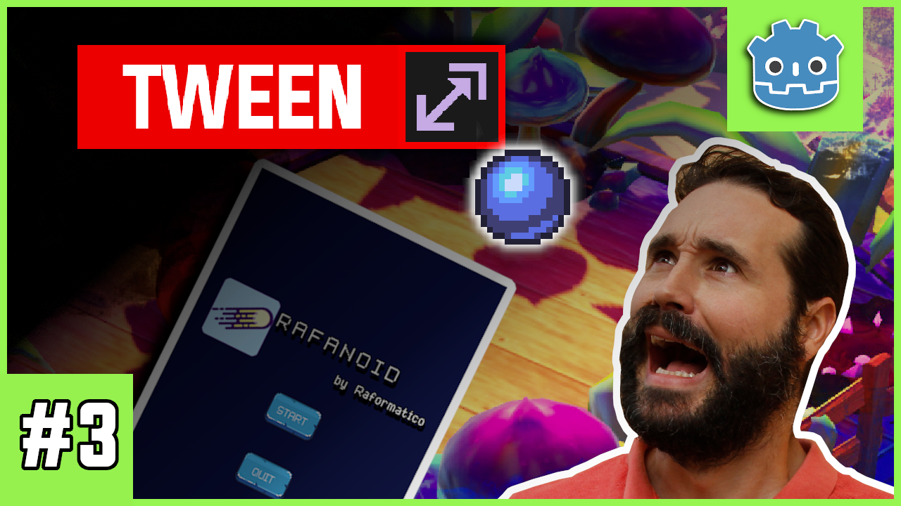

# Extra3 Curso Godot Completo - Transiciones con Nodo Tween Godot GDScript
Aprende a utilizar el nodo Tween con transiciones entre escenas en Godot Engine 3.2. 

*consulta el videotutorial [aquí](https://www.youtube.com/watch?v=dbw8pEnJChQ)*

### ¿Cómo colaborar con el proyecto?

Si tras hacer el curso te sientes agradecido y quieres apoyarme puedes hacerlo de alguna de las siguientes maneras:

- Comentando y valorando positivamente el curso en [Udemy](https://www.udemy.com/course/godot-3-primer-videojuego/) o [Tutellus](https://www.tutellus.com/tecnologia/videojuegos/haz-tu-primer-videojuego-con-godot-32-30039)
- Suscribiéndote a [mi canal de YouTube de Raformático](https://www.youtube.com/c/raformatico) y comentando positivamente o indicando que te gusta lo que hago. Ya sabes que la interacción social es lo que más valora YouTube para recomendar los vídeos a otras personas...
- [Invitándome a un cafelito](https://www.buymeacoffee.com/raformatico), me viene muy bien para tomar energía y hacer más cursos ;D