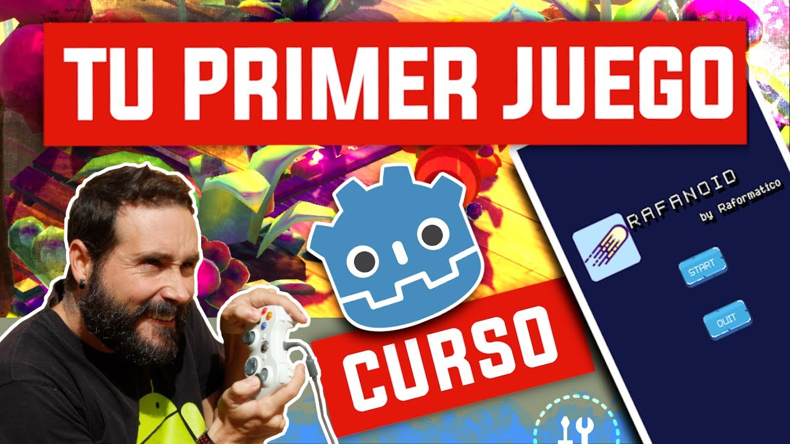
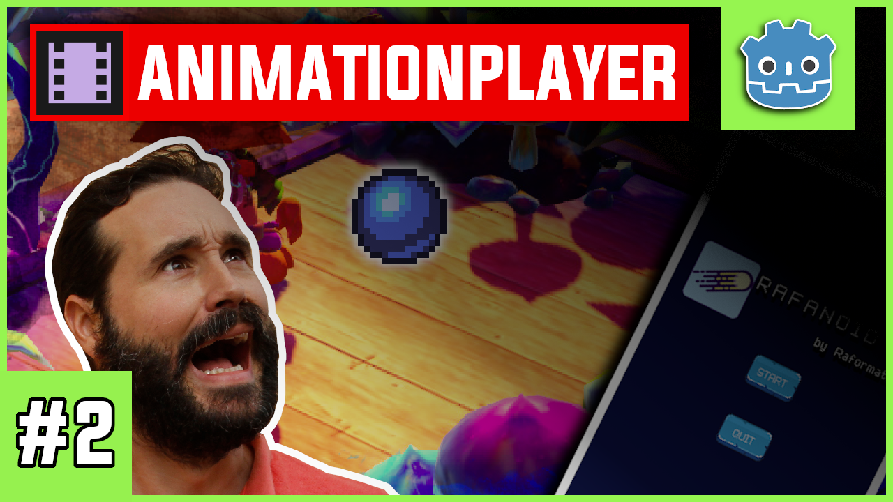
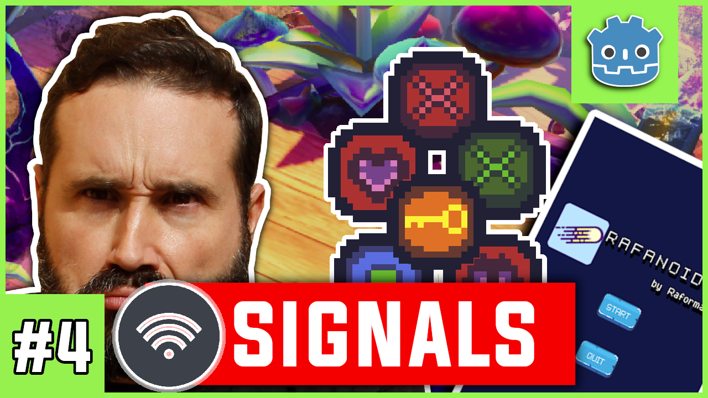
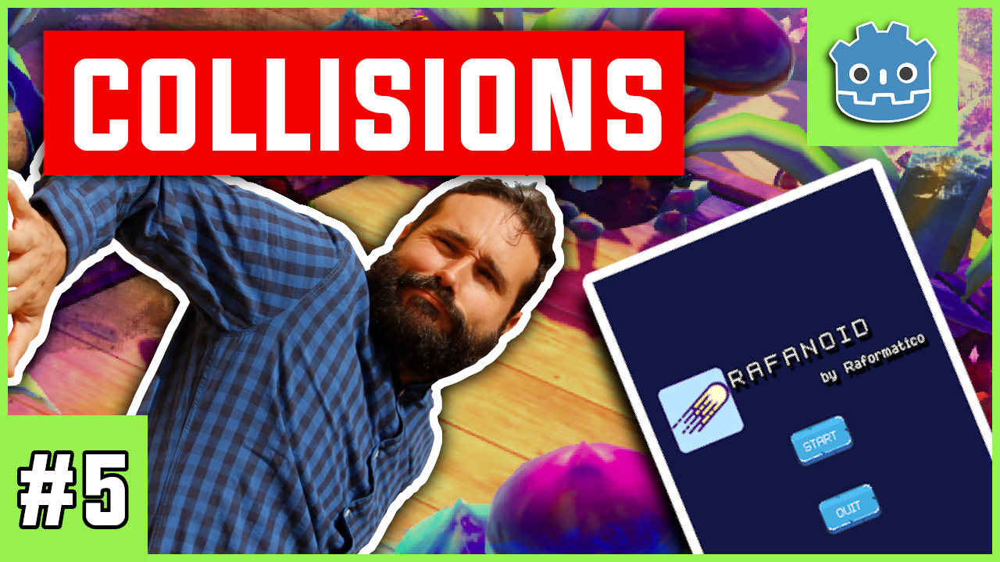
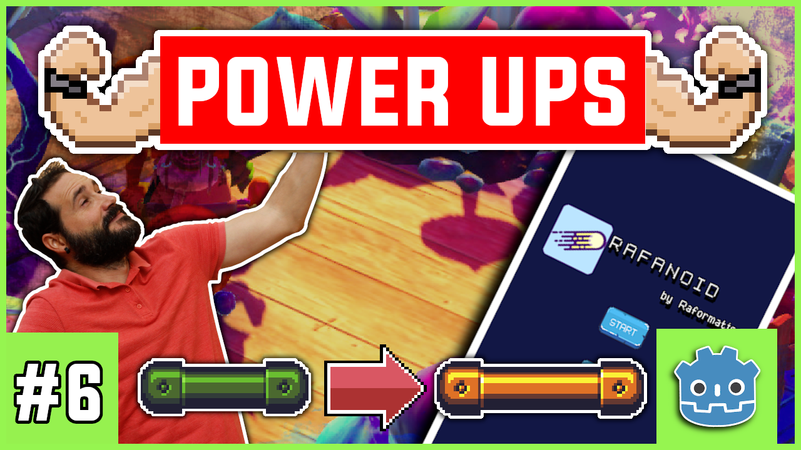

# Rafanoid: Curso Godot Completo - Desarrolla tu primer videojuego en Godot Engine 3.2 usando GDScript

*consulta todos los videotutoriales en la [playlist](https://www.youtube.com/watch?v=1wSwA1cYzIA&list=PLpdhBEtT9SDn2_tc1G8cZHHUhywJxLFU3)*

¿Te gustaría aprender a crear un videojuego completo en Godot 3.2? ¿Quieres conectar todos esos conocimientos que tienes y comenzar y **al fin finalizar un proyecto desde 0?** Si es así, no lo dudes y únete al curso (puedes ver los videotutoriales [en mi canal de YouTube - Raformatico-](https://www.youtube.com/c/raformatico) o si te es más cómodo seguirlo en [Udemy](https://www.udemy.com/course/godot-3-primer-videojuego/) o [Tutellus](https://www.tutellus.com/tecnologia/videojuegos/haz-tu-primer-videojuego-con-godot-32-30039)).

He montado este curso en base a mi experiencia como formador de programación a distintos niveles y con el objetivo de hacer llegar la capacitación de programación a cuanta más gente sea posible mejor. Es posible aprender las técnicas más importantes de desarrollo de videojuegos utilizando únicamente programas de software libre y GDscript (lenguaje de programación muy similar a Python).

**En el desarrollo de este juego (Rafanoid) vas a aprender gran cantidad de conceptos útiles** para crear una amplia variedad de videojuegos 2D en Godot, tales como:

1. **Creación del menú del juego** para gestionar el inicio y fin del juego
2. **Gestión de colisiones** tanto de forma sencilla como compleja
3. **Programar utilizando el lenguaje de programación GDScript** Esto es un 2x1! Si aprendes GDScript das un gran paso para aprender Python
4. **Manejar a través de la interfaz gráfica y GDScript** la creación y destrucción de objetos y escenas en función de los eventos del juego
5. **Añadir sonidos al juego** Un juego sin sonidos no es un juego! Aprende a incluirlos en los momentos clave
6. **Crear una estructura óptima** para ordenar los recursos, escenas y *scripts* de tu juego
7. **Utilización de sprites** tanto para tus jugadores, como para los elementos del juego

**Estoy convencido de que merece la pena.** Aprovecha la oportunidad que te ofrece este curso gratuito para reforzar tus conocimientos de programación y para utilizar tu creatividad en relación a la creación de videojuegos.

### ¿Cómo colaborar con el proyecto?

Si tras hacer el curso te sientes agradecido y quieres apoyarme puedes hacerlo de alguna de las siguientes maneras:

- Marcando este repositorio como favorito para facilitar que otra gente pueda encontrarlo
- Comentando y valorando positivamente el curso en [Udemy](https://www.udemy.com/course/godot-3-primer-videojuego/) o [Tutellus](https://www.tutellus.com/tecnologia/videojuegos/haz-tu-primer-videojuego-con-godot-32-30039)
- Suscribiéndote a [mi canal de YouTube de Raformático](https://www.youtube.com/c/raformatico) y comentando positivamente o indicando que te gusta lo que hago. Ya sabes que la interacción social es lo que más valora YouTube para recomendar los vídeos a otras personas...
- [Invitándome a un cafelito](https://www.buymeacoffee.com/raformatico), me viene muy bien para tomar energía y hacer más cursos ;D

### En este curso podrás aprender

- Conceptos fundamentales de desarrollo de videojuegos en una herramienta muy potente de software libre: Godot 3.2
- Lenguaje de programación GDScript basado en Python (aprendes 2 en 1!)
- Crear y destruir objetos y escenas en función de los eventos del juego
- Crear menús de juego
- Utilizar señales para comunicar los objetos de juego
- Utilizar el nodo de Particles2D para crear partículas en el movimiento de la pelota
- Utilizar los nodos Animation Player y Tween para animaciones básicas
- Utilizar señales singleton
- Entregar Powerups al jugador

### Descripción de los Extras del curso

En cada carpeta titulada como Extra podrás obtener acceso a avances del curso básico cuya explicación sólo está en el canal de YouTube. Los extras disponibles son:

#### Extra1 Curso Godot Completo - Particles 2D en Godot engine

*consulta el videotutorial [aquí](https://www.youtube.com/watch?v=sQ_NhtFkv4M)*

#### Extra2 Curso Godot Completo - Transiciones con Animation Player en Godot

*consulta el videotutorial [aquí](https://www.youtube.com/watch?v=cd3kvIf8AoQ)*

#### Extra3 Curso Godot Completo - Transiciones con Nodo Tween Godot GDScript

*consulta el videotutorial [aquí](https://www.youtube.com/watch?v=dbw8pEnJChQ)*

#### Extra4 Curso Godot Completo - Uso de señales singleton para recoger objetos con GDScript

*consulta el videotutorial [aquí](https://www.youtube.com/watch?v=Mo6sbDlk0nQ)*

#### Extra5 Curso Godot Completo - Uso de collision masks y layers

*consulta el videotutorial [aquí](https://www.youtube.com/watch?v=8FILrmpwWo4)*

#### Extra6 Curso Godot Completo - Implementación de Power Ups en Rafanoid

*consulta el videotutorial [aquí](https://www.youtube.com/watch?v=98j1v8cz2n8)*